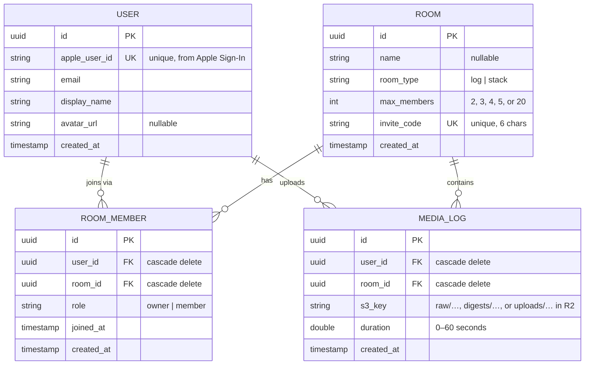

# SnapLog – Entity Relationship Diagram

## Notes

- `ROOM_MEMBER` is the pivot table for the many-to-many `USER ↔ ROOM` relationship (Fluent `@Siblings` on both models).
- Unique indexes: `users.apple_user_id`, `rooms.invite_code`, and `(room_member.user_id, room_member.room_id)`.
- Deleting a `USER` or `ROOM` cascades to their `ROOM_MEMBER` rows and `MEDIA_LOG` rows.
- `MEDIA_LOG.s3_key` references objects in Cloudflare R2 (not a DB relation).
